# Benchmark report

## balance+scale dataset
|                    | deletion rate   |   cb_size |   step | F1      | accuracy   | weighted_nn_accuracy   | 1nn_accuracy   |
|:-------------------|:----------------|----------:|-------:|:--------|:-----------|:-----------------------|:---------------|
| initial            | 0.00%           |       375 |      0 | 55.83%  | 56.80%     | 31.20%                 | 42.40%         |
| best MeATCube F1   | 80.80%          |        72 |    303 | 100.00% | 100.00%    | 37.60%                 | 36.80%         |
| best MeATCube acc. | 80.80%          |        72 |    303 | 100.00% | 100.00%    | 37.60%                 | 36.80%         |
| best KNN acc.      | 98.40%          |         6 |    369 | 64.94%  | 72.80%     | 56.80%                 | 62.40%         |
| best 1NN acc.      | 98.40%          |         6 |    369 | 64.94%  | 72.80%     | 56.80%                 | 62.40%         |

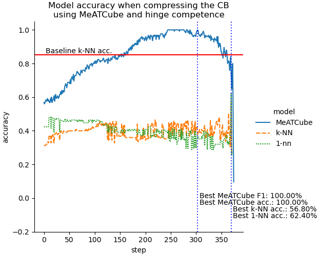

## breast+cancer+wisconsin+diagnostic dataset
|                    | deletion rate   |   cb_size |   step | F1     | accuracy   | weighted_nn_accuracy   | 1nn_accuracy   |
|:-------------------|:----------------|----------:|-------:|:-------|:-----------|:-----------------------|:---------------|
| initial            | 0.00%           |       341 |      0 | 90.48% | 91.23%     | 61.40%                 | 92.98%         |
| best MeATCube F1   | 79.18%          |        71 |    270 | 94.45% | 94.74%     | 79.82%                 | 60.53%         |
| best MeATCube acc. | 79.18%          |        71 |    270 | 94.45% | 94.74%     | 79.82%                 | 60.53%         |
| best KNN acc.      | 65.40%          |       118 |    223 | 91.83% | 92.11%     | 86.84%                 | 51.75%         |
| best 1NN acc.      | 4.11%           |       327 |     14 | 90.58% | 91.23%     | 61.40%                 | 94.74%         |

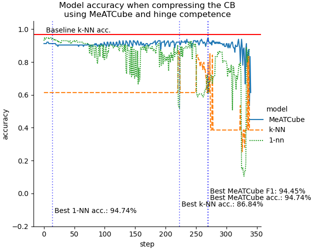

## breast+cancer+wisconsin+prognostic dataset
|                    | deletion rate   |   cb_size |   step | F1     | accuracy   | weighted_nn_accuracy   | 1nn_accuracy   |
|:-------------------|:----------------|----------:|-------:|:-------|:-----------|:-----------------------|:---------------|
| initial            | 0.00%           |       116 |      0 | 47.77% | 69.23%     | 66.67%                 | 69.23%         |
| best MeATCube F1   | 70.69%          |        34 |     82 | 79.40% | 82.05%     | 66.67%                 | 61.54%         |
| best MeATCube acc. | 70.69%          |        34 |     82 | 79.40% | 82.05%     | 66.67%                 | 61.54%         |
| best KNN acc.      | 97.41%          |         3 |    113 | 61.73% | 71.79%     | 66.67%                 | 64.10%         |
| best 1NN acc.      | 43.10%          |        66 |     50 | 62.01% | 69.23%     | 66.67%                 | 74.36%         |

## credit+approval dataset
|                    | deletion rate   |   cb_size |   step | F1     | accuracy   | weighted_nn_accuracy   | 1nn_accuracy   |
|:-------------------|:----------------|----------:|-------:|:-------|:-----------|:-----------------------|:---------------|
| initial            | 0.00%           |       391 |      0 | 65.78% | 69.47%     | 52.67%                 | 46.56%         |
| best MeATCube F1   | 50.13%          |       195 |    196 | 80.55% | 80.92%     | 72.52%                 | 69.47%         |
| best MeATCube acc. | 77.75%          |        87 |    304 | 80.25% | 80.92%     | 54.20%                 | 57.25%         |
| best KNN acc.      | 53.45%          |       182 |    209 | 73.28% | 73.28%     | 75.57%                 | 69.47%         |
| best 1NN acc.      | 71.10%          |       113 |    278 | 78.17% | 78.63%     | 48.09%                 | 73.28%         |

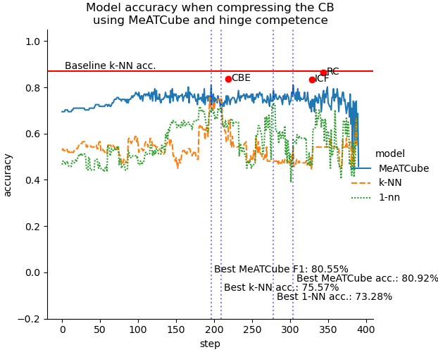

## dermatology dataset
|                    | deletion rate   |   cb_size |   step | F1     | accuracy   | weighted_nn_accuracy   | 1nn_accuracy   |
|:-------------------|:----------------|----------:|-------:|:-------|:-----------|:-----------------------|:---------------|
| initial            | 0.00%           |       214 |      0 | 43.43% | 50.00%     | 27.78%                 | 11.11%         |
| best MeATCube F1   | 85.51%          |        31 |    183 | 91.20% | 93.06%     | 20.83%                 | 38.89%         |
| best MeATCube acc. | 73.36%          |        57 |    157 | 81.13% | 97.22%     | 52.78%                 | 55.56%         |
| best KNN acc.      | 82.24%          |        38 |    176 | 75.48% | 91.67%     | 52.78%                 | 58.33%         |
| best 1NN acc.      | 46.73%          |       114 |    100 | 75.25% | 90.28%     | 52.78%                 | 69.44%         |

## glass+identification dataset
|                    | deletion rate   |   cb_size |   step | F1     | accuracy   | weighted_nn_accuracy   | 1nn_accuracy   |
|:-------------------|:----------------|----------:|-------:|:-------|:-----------|:-----------------------|:---------------|
| initial            | 0.00%           |       128 |      0 | 17.50% | 20.93%     | 60.47%                 | 27.91%         |
| best MeATCube F1   | 67.19%          |        42 |     86 | 56.07% | 79.07%     | 6.98%                  | 6.98%          |
| best MeATCube acc. | 67.19%          |        42 |     86 | 56.07% | 79.07%     | 6.98%                  | 6.98%          |
| best KNN acc.      | 55.47%          |        57 |     71 | 44.90% | 60.47%     | 60.47%                 | 53.49%         |
| best 1NN acc.      | 52.34%          |        61 |     67 | 48.87% | 62.79%     | 60.47%                 | 62.79%         |

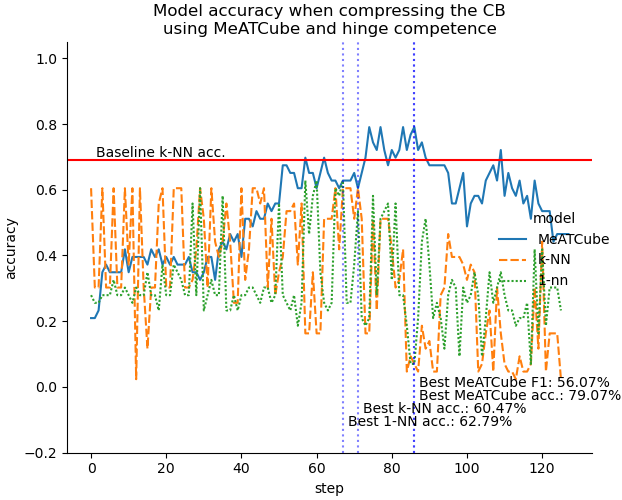

## haberman+s+survival dataset
|                    | deletion rate   |   cb_size |   step | F1     | accuracy   | weighted_nn_accuracy   | 1nn_accuracy   |
|:-------------------|:----------------|----------:|-------:|:-------|:-----------|:-----------------------|:---------------|
| initial            | 0.00%           |       183 |      0 | 48.74% | 75.41%     | 73.77%                 | 42.62%         |
| best MeATCube F1   | 70.49%          |        54 |    129 | 87.77% | 90.16%     | 80.33%                 | 45.90%         |
| best MeATCube acc. | 70.49%          |        54 |    129 | 87.77% | 90.16%     | 80.33%                 | 45.90%         |
| best KNN acc.      | 57.38%          |        78 |    105 | 67.38% | 73.77%     | 83.61%                 | 57.38%         |
| best 1NN acc.      | 98.36%          |         3 |    180 | 64.33% | 75.41%     | 67.21%                 | 77.05%         |

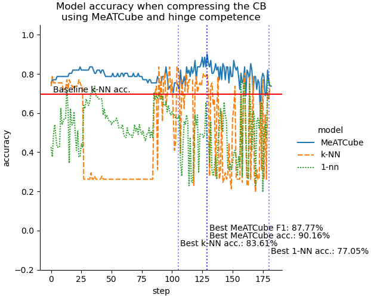

## heart+disease dataset
|                    | deletion rate   |   cb_size |   step | F1     | accuracy   | weighted_nn_accuracy   | 1nn_accuracy   |
|:-------------------|:----------------|----------:|-------:|:-------|:-----------|:-----------------------|:---------------|
| initial            | 0.00%           |       177 |      0 | 12.37% | 26.67%     | 1.67%                  | 38.33%         |
| best MeATCube F1   | 59.89%          |        71 |    106 | 42.95% | 58.33%     | 25.00%                 | 43.33%         |
| best MeATCube acc. | 59.32%          |        72 |    105 | 42.23% | 60.00%     | 25.00%                 | 40.00%         |
| best KNN acc.      | 97.74%          |         4 |    173 | 23.06% | 56.67%     | 50.00%                 | 45.00%         |
| best 1NN acc.      | 25.42%          |       132 |     45 | 19.88% | 38.33%     | 15.00%                 | 53.33%         |

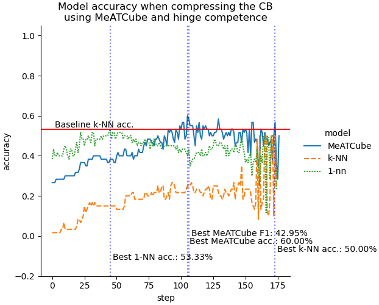

## hepatitis dataset
|                    | deletion rate   |   cb_size |   step | F1      | accuracy   | weighted_nn_accuracy   | 1nn_accuracy   |
|:-------------------|:----------------|----------:|-------:|:--------|:-----------|:-----------------------|:---------------|
| initial            | 0.00%           |        48 |      0 | 46.67%  | 87.50%     | 12.50%                 | 75.00%         |
| best MeATCube F1   | 79.17%          |        10 |     38 | 100.00% | 100.00%    | 12.50%                 | 62.50%         |
| best MeATCube acc. | 79.17%          |        10 |     38 | 100.00% | 100.00%    | 12.50%                 | 62.50%         |
| best KNN acc.      | 95.83%          |         2 |     46 | 46.67%  | 87.50%     | 87.50%                 | 87.50%         |
| best 1NN acc.      | 95.83%          |         2 |     46 | 46.67%  | 87.50%     | 87.50%                 | 87.50%         |

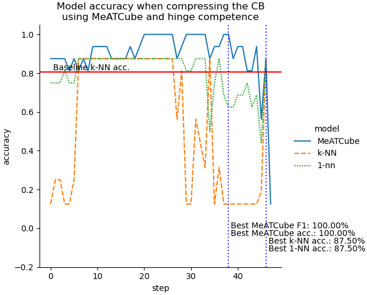

## ionosphere dataset
|                    | deletion rate   |   cb_size |   step | F1     | accuracy   | weighted_nn_accuracy   | 1nn_accuracy   |
|:-------------------|:----------------|----------:|-------:|:-------|:-----------|:-----------------------|:---------------|
| initial            | 0.00%           |       210 |      0 | 47.23% | 67.14%     | 65.71%                 | 84.29%         |
| best MeATCube F1   | 67.62%          |        68 |    142 | 96.83% | 97.14%     | 72.86%                 | 62.86%         |
| best MeATCube acc. | 67.62%          |        68 |    142 | 96.83% | 97.14%     | 72.86%                 | 62.86%         |
| best KNN acc.      | 82.86%          |        36 |    174 | 93.88% | 94.29%     | 84.29%                 | 54.29%         |
| best 1NN acc.      | 10.95%          |       187 |     23 | 63.54% | 74.29%     | 67.14%                 | 88.57%         |

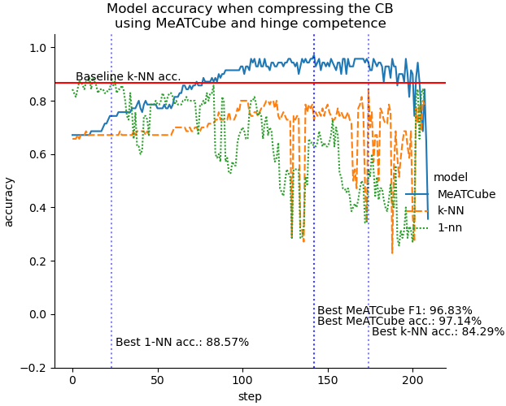

## iris dataset
|                    | deletion rate   |   cb_size |   step | F1      | accuracy   | weighted_nn_accuracy   | 1nn_accuracy   |
|:-------------------|:----------------|----------:|-------:|:--------|:-----------|:-----------------------|:---------------|
| initial            | 0.00%           |        90 |      0 | 96.71%  | 96.67%     | 96.67%                 | 83.33%         |
| best MeATCube F1   | 91.11%          |         8 |     82 | 100.00% | 100.00%    | 0.00%                  | 0.00%          |
| best MeATCube acc. | 91.11%          |         8 |     82 | 100.00% | 100.00%    | 0.00%                  | 0.00%          |
| best KNN acc.      | 92.22%          |         7 |     83 | 96.71%  | 96.67%     | 100.00%                | 100.00%        |
| best 1NN acc.      | 92.22%          |         7 |     83 | 96.71%  | 96.67%     | 100.00%                | 100.00%        |

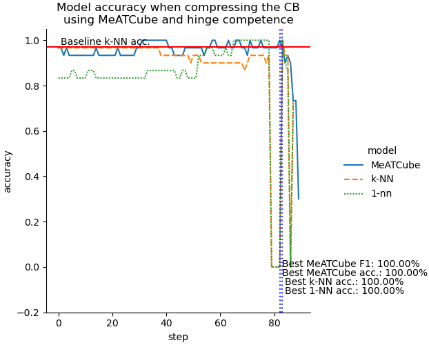

## kaggle+pima+indian+diabetes dataset
|                    | deletion rate   |   cb_size |   step | F1     | accuracy   | weighted_nn_accuracy   | 1nn_accuracy   |
|:-------------------|:----------------|----------:|-------:|:-------|:-----------|:-----------------------|:---------------|
| initial            | 0.00%           |       460 |      0 | 48.25% | 67.53%     | 51.30%                 | 68.83%         |
| best MeATCube F1   | 68.70%          |       144 |    316 | 87.05% | 88.31%     | 60.39%                 | 58.44%         |
| best MeATCube acc. | 68.70%          |       144 |    316 | 87.05% | 88.31%     | 60.39%                 | 58.44%         |
| best KNN acc.      | 30.65%          |       319 |    141 | 75.76% | 77.92%     | 78.57%                 | 33.77%         |
| best 1NN acc.      | 98.70%          |         6 |    454 | 69.10% | 69.48%     | 74.68%                 | 71.43%         |

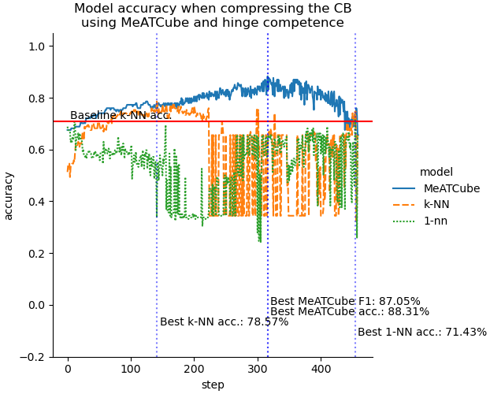

## kaggle+teaching+assistant+evaluation dataset
|                    | deletion rate   |   cb_size |   step | F1     | accuracy   | weighted_nn_accuracy   | 1nn_accuracy   |
|:-------------------|:----------------|----------:|-------:|:-------|:-----------|:-----------------------|:---------------|
| initial            | 0.00%           |        90 |      0 | 26.10% | 26.67%     | 36.67%                 | 40.00%         |
| best MeATCube F1   | 70.00%          |        27 |     63 | 75.43% | 76.67%     | 40.00%                 | 53.33%         |
| best MeATCube acc. | 70.00%          |        27 |     63 | 75.43% | 76.67%     | 40.00%                 | 53.33%         |
| best KNN acc.      | 60.00%          |        36 |     54 | 66.46% | 66.67%     | 63.33%                 | 56.67%         |
| best 1NN acc.      | 92.22%          |         7 |     83 | 61.31% | 63.33%     | 40.00%                 | 66.67%         |

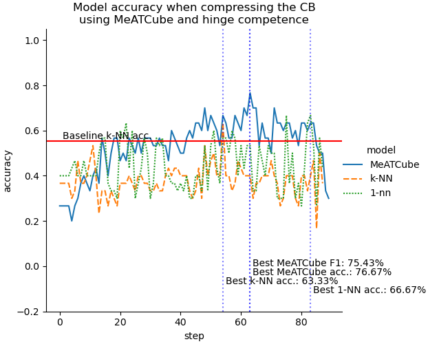

## lenses dataset
|                    | deletion rate   |   cb_size |   step | F1     | accuracy   | weighted_nn_accuracy   | 1nn_accuracy   |
|:-------------------|:----------------|----------:|-------:|:-------|:-----------|:-----------------------|:---------------|
| initial            | 0.00%           |        14 |      0 | 0.00%  | 0.00%      | 0.00%                  | 20.00%         |
| best MeATCube F1   | 35.71%          |         9 |      5 | 61.11% | 60.00%     | 20.00%                 | 60.00%         |
| best MeATCube acc. | 78.57%          |         3 |     11 | 60.00% | 80.00%     | -100.00%               | -100.00%       |
| best KNN acc.      | 71.43%          |         4 |     10 | 44.44% | 60.00%     | 60.00%                 | 60.00%         |
| best 1NN acc.      | 21.43%          |        11 |      3 | 0.00%  | 0.00%      | 40.00%                 | 80.00%         |

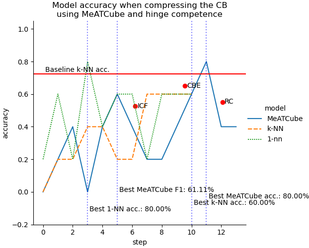

## liver+disorders dataset
|                    | deletion rate   |   cb_size |   step | F1     | accuracy   | weighted_nn_accuracy   | 1nn_accuracy   |
|:-------------------|:----------------|----------:|-------:|:-------|:-----------|:-----------------------|:---------------|
| initial            | 0.00%           |       207 |      0 | 63.57% | 69.57%     | 42.03%                 | 40.58%         |
| best MeATCube F1   | 52.66%          |        98 |    109 | 85.76% | 86.96%     | 56.52%                 | 55.07%         |
| best MeATCube acc. | 52.66%          |        98 |    109 | 85.76% | 86.96%     | 56.52%                 | 55.07%         |
| best KNN acc.      | 57.00%          |        89 |    118 | 83.37% | 84.06%     | 66.67%                 | 44.93%         |
| best 1NN acc.      | 67.63%          |        67 |    140 | 76.21% | 76.81%     | 46.38%                 | 65.22%         |

## lung+cancer dataset
|                    | deletion rate   |   cb_size |   step | F1      | accuracy   | weighted_nn_accuracy   | 1nn_accuracy   |
|:-------------------|:----------------|----------:|-------:|:--------|:-----------|:-----------------------|:---------------|
| initial            | 0.00%           |        15 |      0 | 72.22%  | 66.67%     | 0.00%                  | 0.00%          |
| best MeATCube F1   | 46.67%          |         8 |      7 | 100.00% | 100.00%    | 16.67%                 | 0.00%          |
| best MeATCube acc. | 46.67%          |         8 |      7 | 100.00% | 100.00%    | 16.67%                 | 0.00%          |
| best KNN acc.      | 80.00%          |         3 |     12 | 58.33%  | 66.67%     | 16.67%                 | 16.67%         |
| best 1NN acc.      | 13.33%          |        13 |      2 | 84.13%  | 83.33%     | 16.67%                 | 33.33%         |

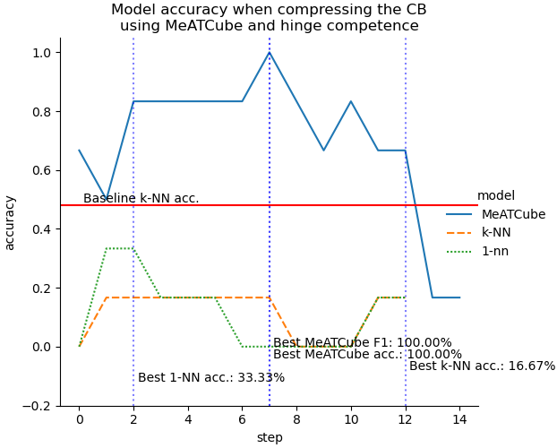

## post+operative+patient dataset
|                    | deletion rate   |   cb_size |   step | F1     | accuracy   | weighted_nn_accuracy   | 1nn_accuracy   |
|:-------------------|:----------------|----------:|-------:|:-------|:-----------|:-----------------------|:---------------|
| initial            | 0.00%           |        51 |      0 | 21.21% | 38.89%     | 38.89%                 | 44.44%         |
| best MeATCube F1   | 80.39%          |        10 |     41 | 39.95% | 55.56%     | 50.00%                 | 66.67%         |
| best MeATCube acc. | 80.39%          |        10 |     41 | 39.95% | 55.56%     | 50.00%                 | 66.67%         |
| best KNN acc.      | 76.47%          |        12 |     39 | 32.22% | 38.89%     | 72.22%                 | 72.22%         |
| best 1NN acc.      | 76.47%          |        12 |     39 | 32.22% | 38.89%     | 72.22%                 | 72.22%         |

## wine dataset
|                    | deletion rate   |   cb_size |   step | F1     | accuracy   | weighted_nn_accuracy   | 1nn_accuracy   |
|:-------------------|:----------------|----------:|-------:|:-------|:-----------|:-----------------------|:---------------|
| initial            | 0.00%           |       106 |      0 | 72.54% | 72.22%     | 72.22%                 | 41.67%         |
| best MeATCube F1   | 75.47%          |        26 |     80 | 94.51% | 94.44%     | 61.11%                 | 36.11%         |
| best MeATCube acc. | 75.47%          |        26 |     80 | 94.51% | 94.44%     | 61.11%                 | 36.11%         |
| best KNN acc.      | 83.02%          |        18 |     88 | 83.11% | 83.33%     | 91.67%                 | 75.00%         |
| best 1NN acc.      | 83.96%          |        17 |     89 | 85.17% | 86.11%     | 72.22%                 | 86.11%         |

## zoo dataset
|                    | deletion rate   |   cb_size |   step | F1      | accuracy   | weighted_nn_accuracy   | 1nn_accuracy   |
|:-------------------|:----------------|----------:|-------:|:--------|:-----------|:-----------------------|:---------------|
| initial            | 0.00%           |        60 |      0 | 73.67%  | 85.00%     | 35.00%                 | 30.00%         |
| best MeATCube F1   | 85.00%          |         9 |     51 | 100.00% | 100.00%    | 25.00%                 | 5.00%          |
| best MeATCube acc. | 85.00%          |         9 |     51 | 100.00% | 100.00%    | 25.00%                 | 5.00%          |
| best KNN acc.      | 88.33%          |         7 |     53 | 78.57%  | 80.00%     | 65.00%                 | 60.00%         |
| best 1NN acc.      | 40.00%          |        36 |     24 | 100.00% | 100.00%    | 35.00%                 | 95.00%         |

